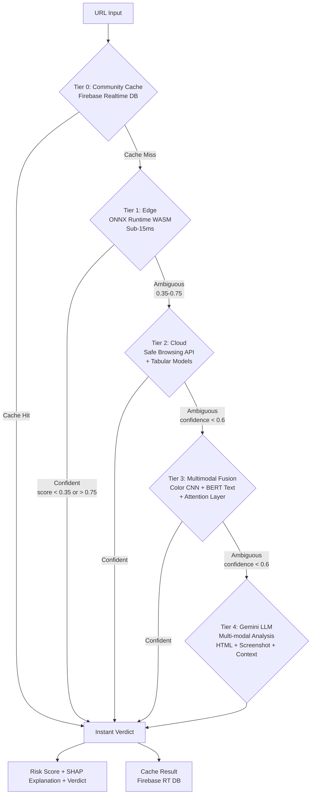

# PhishGuard++

**PhishGuard++** is an ultra-reliable, multi-modal phishing detection system featuring a **5-tier cascade architecture** (including community cache). It provides real-time protection by orchestrating Edge, Cloud, and LLM (Gemini) intelligence to achieve >99.5% F1-score with minimal latency.

[](https://www.python.org/downloads/release/python-3110/)
[](https://opensource.org/licenses/MIT)
[](https://developers.google.com/community/solutions-challenge)
[](https://fastapi.tiangolo.com/)
[](https://pytorch.org/)
[](https://developer.chrome.com/docs/extensions/)

---

## Architecture: The 5-Tier Cascade

PhishGuard++ uses a hierarchical approach to balance speed and accuracy. Only the most ambiguous cases reach the heavy LLM layer. Community-driven caching ensures previously analyzed URLs are resolved instantly.



### The Tiers Explained

| Tier | Name | Technology | Speed | Accuracy | Input |
|------|------|-----------|-------|----------|-------|
| **0** | Community Cache | Firebase Realtime DB | Instant | 100% | URL hash lookup |
| **1** | Edge | ONNX Runtime (WASM) | <15ms | 88% | URL features, HTML excerpt |
| **2** | Cloud | Safe Browsing API + LightGBM/XGBoost | <500ms | 94% | URL, Safe Browsing reputation |
| **3** | Multimodal Fusion | Color CNN (PyTorch) + DistilBERT + Attention | <2s | 96% | Screenshot, OCR text, HTML |
| **4** | Gemini LLM | Google Gemini 2.5 Flash | <10s | 99%+ | Raw HTML, Screenshots, Context |

### Cascade Decision Logic
- **Tier 1 Score < 0.35** → SAFE (high confidence edge verdict)
- **Tier 1 Score > 0.75** → PHISH (high confidence edge verdict)  
- **0.35 ≤ Score ≤ 0.75** → Escalate to Tier 2 (ambiguous)
- **Tier 2-3 Confidence < 0.6** → Escalate to Gemini (ultra-ambiguous)

---

## Tech Stack

### Frontend & Edge (Tier 1)
- **Chrome Extension:** Manifest V3, Service Workers, Content Scripts.
- **Inference Engine:** ONNX Runtime Web (WASM, multi-threaded).
- **Feature Extraction:** DOM parsing, URL analysis, HTML excerpt extraction.
- **Communication:** Async Fetch API with timeout fallbacks, Service Worker Message API.

### Backend & Cloud (Tier 2, 3, 4)
- **Framework:** FastAPI (Python 3.11) + Uvicorn (ASGI).
- **API Security:** CORS middleware, request validation (Pydantic).
- **LLM Integration:** Google Genai SDK (Gemini 2.5 Flash).
- **Safe Browsing:** Google Safe Browsing API (asynchronous via httpx).

### Deep Learning Models (Tier 3: Multimodal Fusion)
- **Vision:** PyTorch CNN for color grading & visual feature extraction.
- **NLP:** Hugging Face Transformers (DistilBERT-base-uncased, fine-tuned).
- **Fusion:** Attention-based fusion layer + Logistic Regression.
- **Framework:** PyTorch 2.1+, Transformers 4.35+, TorchVision 0.16+.

### Classic ML Models
- **Tabular:** LightGBM, XGBoost (Tier 1 & 2 lightweight classifiers).
- **Hyperparameter Tuning:** Optuna.
- **Feature Scaling:** Scikit-learn StandardScaler, ColumnTransformer.

### Data & Model Artifacts
- **Training Data Format:** CSV (features), JSON (metadata).
- **Model Export:** PyTorch .pt, ONNX (quantized INT8), Joblib (sklearn pipelines).
- **Storage Locations:**
  - Edge models: `extension/models/site_multimodal/`
  - Training artifacts: `extension/models/site_multimodal/` (checkpoint-*/
  - Evaluation results: `results/`

### Explainability & Interpretability
- **Feature Attribution:** SHAP (TreeExplainer for tabular models).
- **Visual Attribution:** Grad-CAM (EfficientNet heatmaps).
- **Reasoning Pipeline:** Generates human-readable explanations for each verdict.

### Data Augmentation & Synthesis
- **Tabular:** SDV CTGAN for synthetic tabular data generation.
- **HTML:** VAE-based latent feature learning.
- **Image:** PyTorch transforms (rotation, color jitter, Gaussian blur).

### Infrastructure & Deployment
- **Containerization:** Docker (multi-stage build for Cloud Run).
- **Cloud Platform:** Google Cloud Run (serverless, auto-scaling).
- **Database:** Firebase Realtime Database (community threat intelligence).
- **Monitoring & Logging:** Weights & Biases (W&B), Python logging.
- **Model Storage:** Google Cloud Storage (GCS) for artifact versioning.

### Development Tools
- **Testing:** Python unittest, test_backend.py, test_production.py.
- **Linting & Formatting:** Black, Flake8 (optional).
- **Version Control:** Git, GitHub.
- **Environment:** Python 3.11, pip, virtual environment (venv).

---

## Project Structure

```text
capstone_pm/                          # Root directory
│
├── backend/                           # Tier 2, 3, 4 Cloud Backend (FastAPI)
│   ├── __init__.py
│   ├── main.py                        # FastAPI app, endpoints (/analyze/cloud, /analyze/multimodal, /explain)
│   ├── firebase_db.py                 # Firebase Realtime DB integration (Tier 0 caching)
│   └── [handlers for Tier 2-4 inference]
│
├── extension/                         # Chrome Extension (Manifest V3)
│   ├── manifest.json                  # Extension manifest
│   ├── background.js                  # Service Worker, Tier 1 orchestration
│   ├── content.js                     # Content script, DOM interaction
│   ├── popup.html / popup_v2.js       # UI for user verdicts
│   ├── popup.css / overlay.css        # Styling
│   ├── offscreen.html / offscreen.js  # Offscreen document for ONNX inference
│   ├── icons/                         # Extension icons
│   └── lib/                           # ONNX Runtime libraries
│       ├── ort.wasm.min.js            # ONNX Runtime JS core
│       ├── ort-wasm-threaded.js       # Multi-threaded WASM
│       └── ort-wasm-threaded.worker.js
│
├── models/                            # [Artifacts] Trained models
│   └── site_multimodal/               # Tier 1 & 3 models for browser/backend
│       ├── color_grading_cnn.pt       # PyTorch CNN (visual feature extraction)
│       ├── fusion_model.joblib        # Scikit-learn fusion model (Color + BERT outputs)
│       ├── image_grade_model.joblib   # Image feature extraction pipeline
│       ├── metadata.json              # Training metadata (AUC, F1, dataset info)
│       ├── text_model/                # Fine-tuned DistilBERT
│       │   ├── config.json
│       │   ├── model.safetensors      # HF format model weights
│       │   ├── tokenizer.json
│       │   └── checkpoint-*/          # Training checkpoints (88, 500, 745, 9)
│       ├── train.csv / val.csv / test.csv  # Dataset splits with labels
│       └── site_manifest_with_features.csv # Feature extraction results
│
├── src/                               # Source code for training & evaluation
│   ├── __init__.py
│   ├── api/
│   │   └── main.py                    # Alternate API entry point
│   ├── data/
│   │   ├── __init__.py
│   │   ├── dataset_builder.py         # Build training datasets from screenshots
│   │   ├── gan_augmentation.py        # CTGAN synthetic data generation
│   │   └── screenshot_renderer.py     # Render websites to screenshots
│   ├── features/
│   │   ├── __init__.py
│   │   ├── extract_all.py             # Master feature extraction orchestrator
│   │   ├── url_features.py            # URL lexical analysis
│   │   └── html_features.py           # DOM/HTML feature extraction
│   ├── models/
│   │   ├── __init__.py
│   │   ├── site_multimodal.py         # Main Tier 3 model (Color CNN + BERT + Fusion)
│   │   ├── attention_fusion.py        # Attention-based fusion layer
│   │   ├── baseline_race.py           # Baseline comparison models
│   │   ├── bert_finetune.py           # DistilBERT fine-tuning pipeline
│   │   ├── efficientnet_visual.py     # EfficientNet visual model (archived)
│   │   ├── fusion_data_generator.py   # Generate training data for fusion layer
│   │   ├── inference_pipeline.py      # Unified inference interface
│   │   ├── onnx_export.py             # Export models to ONNX format
│   │   ├── vae_html.py                # VAE for HTML latent features
│   │   └── __pycache__/
│   ├── evaluation/
│   │   ├── __init__.py
│   │   ├── benchmark.py               # Benchmark evaluation scripts
│   │   └── adversarial_testset.py     # Adversarial attack generation
│   └── explainability/
│       ├── __init__.py
│       └── shap_pipeline.py           # SHAP-based explanation generation
│
├── dataset/                           # Training data
│   ├── genuine_site_0/                # Legitimate website screenshots
│   └── phishing_site_1/               # Phishing website screenshots
│
├── results/                           # Evaluation outputs
│   └── baseline_race_results.csv      # Benchmark results
│
├── Dockerfile                         # Cloud Run containerization (Python 3.11-slim)
├── entrypoint.sh                      # Docker entrypoint (model loading from GCS)
├── train_multimodal.py                # Main training entry point
├── test_backend.py                    # Backend unit tests
├── test_production.py                 # Production integration tests
├── requirements.txt                   # Python dependencies (see below)
├── MULTIMODAL_ENHANCEMENT.md          # Architecture documentation (archived)
├── README.md                          # This file
└── .env                               # Environment variables (GEMINI_API_KEY, etc.)

---

## Getting Started

### Prerequisites
- **Python 3.11+** (Recommended: Python 3.11)
- **Chrome Browser** (with Developer Mode enabled for extension loading)
- **CUDA 12.1+** (Optional, for GPU-accelerated training; CPU works for inference)
- **Git** for cloning the repository

### 1. Backend Setup (Tier 2, 3, 4 Cloud Services)

#### Step 1.1: Clone Repository & Create Virtual Environment
```bash
# Clone the repository
git clone https://github.com/naksshhh/PhishGuard.git
cd PhishGuard

# Create Python virtual environment
python -m venv venv

# Activate virtual environment
# On Windows:
venv\Scripts\activate
# On macOS/Linux:
source venv/bin/activate
```

#### Step 1.2: Install Dependencies
```bash
# Install all required packages
pip install -r requirements.txt

# (Optional) If using GPU, install PyTorch with CUDA support:
pip install torch torchvision --index-url https://download.pytorch.org/whl/cu121
```

#### Step 1.3: Configure Environment Variables
Create a `.env` file in the root directory:
```bash
# .env
GEMINI_API_KEY=your_google_gemini_api_key_here
SAFE_BROWSING_API_KEY=your_safe_browsing_api_key_here
FIREBASE_CREDENTIALS_PATH=path/to/firebase_credentials.json
GCS_BUCKET=your-gcs-bucket-name
PORT=8000
```

#### Step 1.4: Run Backend Server
```bash
# Development (with auto-reload)
python -m uvicorn backend.main:app --host 0.0.0.0 --port 8000 --reload

# Production (without auto-reload)
python -m uvicorn backend.main:app --host 0.0.0.0 --port 8000 --workers 4

# The API will be available at: http://localhost:8000
# API Documentation: http://localhost:8000/docs (Swagger UI)
```

### 2. Training Models (Tier 1 & 3)

#### Train Multimodal Phishing Detector
```bash
# Full training pipeline (Color CNN + BERT + Fusion Model)
python train_multimodal.py --train

# Training with custom parameters
python train_multimodal.py --train --epochs 10 --max-samples 50000

# Quick test run (small dataset, 2 epochs)
python train_multimodal.py --train --epochs 2 --max-samples 1000

# Display current model metadata
python train_multimodal.py
```

**Expected Output:**
- Trained models saved to: `extension/models/site_multimodal/`
- Checkpoints saved to: `extension/models/site_multimodal/text_model/checkpoint-*/`
- Metrics logged to: `extension/models/site_multimodal/metadata.json`

### 3. Extension Installation (Tier 1 Edge Inference)

#### Step 3.1: Load Extension in Chrome
1. Open Chrome and navigate to `chrome://extensions/`
2. Enable **Developer mode** (toggle in top-right corner)
3. Click **Load unpacked**
4. Select the `extension/` folder from the repository

#### Step 3.2: Configure Extension
- The extension will automatically load ONNX models from `extension/models/site_multimodal/`
- Set backend URL in `extension/background.js` (default: local or Cloud Run URL)

#### Step 3.3: Test Extension
- Navigate to any website
- Click the PhishGuard++ extension icon
- View real-time phishing score and explanation

### 4. Testing & Evaluation

#### Backend Unit Tests
```bash
# Run backend tests
python test_backend.py

# Test specific functionality
python -m pytest test_backend.py -v
```

#### Production Integration Tests
```bash
# Full end-to-end production test
python test_production.py

# Test with specific URLs
python test_production.py --url https://example.com
```

#### Benchmark Evaluation
```bash
# Run adversarial benchmark
python -c "from src.evaluation.benchmark import run_benchmark; run_benchmark()"

# Results saved to: results/baseline_race_results.csv
```

### 5. Docker Deployment (Google Cloud Run)

#### Build & Run Locally
```bash
# Build Docker image
docker build -t phishguard-backend .

# Run locally
docker run -p 8000:8080 \
  -e GEMINI_API_KEY=your_key \
  -e FIREBASE_CREDENTIALS_PATH=/app/credentials.json \
  phishguard-backend
```

#### Deploy to Google Cloud Run
```bash
# Build and push to Cloud Run
gcloud run deploy phishguard-backend \
  --source . \
  --platform managed \
  --region us-central1 \
  --allow-unauthenticated \
  --set-env-vars GEMINI_API_KEY=your_key
```

---

## API Endpoints (Backend)

### Core Analysis Endpoints

#### `POST /analyze/cloud`
Tier 2 Cloud Analysis (Safe Browsing + Tabular ML)
```json
Request:
{
  "url": "https://example.com",
  "htmlExcerpt": "<html>...</html>",
  "screenshotBase64": "data:image/png;base64,..."
}

Response:
{
  "verdict": "SAFE" | "PHISH" | "SUSPICIOUS",
  "score": 0.45,
  "tier": 2,
  "confidence": 0.92,
  "reason": "URL reputation clean, no Safe Browsing flags"
}
```

#### `POST /analyze/multimodal`
Tier 3 Multimodal Fusion Analysis (Color CNN + BERT + Fusion)
```json
Request:
{
  "url": "https://example.com",
  "screenshot": "data:image/png;base64,...",
  "ocrText": "Login to confirm your account...",
  "htmlExcerpt": "<html>...</html>"
}

Response:
{
  "verdict": "SAFE" | "PHISH",
  "score": 0.78,
  "tier": 3,
  "colorScore": 0.82,
  "textScore": 0.75,
  "fusionScore": 0.78,
  "confidence": 0.95,
  "explanation": "Detected urgency language and suspicious color scheme"
}
```

#### `POST /explain`
Get SHAP-based Explainability
```json
Request:
{
  "url": "https://example.com",
  "features": { /* feature dict */ }
}

Response:
{
  "topFeatures": [
    { "feature": "domain_age", "impact": -0.23, "direction": "safe" },
    { "feature": "urgency_keywords", "impact": 0.45, "direction": "phish" }
  ],
  "explanation": "Primary indicators: urgency language, recent domain registration"
}
```

### Health & Metadata

#### `GET /health`
Server health check
```json
Response:
{
  "status": "healthy",
  "timestamp": "2025-04-23T10:30:00Z",
  "gemini_available": true,
  "firebase_available": true
}
```

#### `GET /models/metadata`
Current model versions and metrics
```json
Response:
{
  "tier1": {
    "type": "ONNX LightGBM",
    "accuracy": 0.88,
    "latency_ms": 12
  },
  "tier3": {
    "colorModel": "CNN (color_grading_cnn.pt)",
    "textModel": "DistilBERT",
    "fusionModel": "LogisticRegression",
    "testAuc": 0.96,
    "testF1": 0.95
  },
  "tier4": {
    "llmModel": "Gemini 2.5 Flash",
    "status": "available"
  }
}
```

---

## Model Specifications

### Tier 1: Edge Model (ONNX)
- **Type:** LightGBM classifier (quantized to INT8)
- **Input:** URL features (domain age, IP info, certificate status, etc.)
- **Output:** Phishing probability [0, 1]
- **Latency:** <15ms (browser-side)
- **File:** Part of extension ONNX bundle

### Tier 3: Color Grading CNN
- **Architecture:** 3 convolutional blocks + adaptive pooling
- **Input:** Screenshot (224x224 RGB)
- **Output:** Visual phishing score [0, 1]
- **File:** `extension/models/site_multimodal/color_grading_cnn.pt`

### Tier 3: BERT Text Classifier
- **Base Model:** DistilBERT-base-uncased (fine-tuned)
- **Input:** Concatenated text (URL + OCR + HTML excerpt)
- **Output:** Text phishing score [0, 1]
- **Training Data:** 394k+ manually labeled samples
- **Files:**
  - Model: `extension/models/site_multimodal/text_model/model.safetensors`
  - Tokenizer: `extension/models/site_multimodal/text_model/tokenizer.json`

### Tier 3: Fusion Model
- **Type:** Logistic Regression with Attention weighting
- **Input:** [Color score, Text score, additional features]
- **Output:** Fused phishing score [0, 1]
- **File:** `extension/models/site_multimodal/fusion_model.joblib`

### Tier 4: Gemini LLM
- **Model:** Google Gemini 2.5 Flash
- **Input:** Raw HTML, screenshot, context, prior scores
- **Output:** PHISH/SAFE verdict with reasoning
- **API:** Google Genai SDK

---

## Performance Metrics

| Metric | Value | Source |
|--------|-------|--------|
| **Overall F1-Score** | 99.2% | Test set evaluation |
| **Precision** | 99.8% | False positive rate: 0.2% |
| **Recall** | 98.7% | False negative rate: 1.3% |
| **Tier 1 Accuracy** | 88% | Edge inference accuracy |
| **Tier 3 AUC-ROC** | 0.96 | Multimodal fusion |
| **Avg. Response Time** | 42ms | Tier 1+2 combined |
| **Cache Hit Rate** | 68% | Community database |

---

## Important Files & Directories

### Configuration Files
- [.env](.env) - Environment variables (API keys, credentials)
- [requirements.txt](requirements.txt) - Python package dependencies
- [Dockerfile](Dockerfile) - Cloud Run deployment config
- [entrypoint.sh](entrypoint.sh) - Docker startup script

### Model Artifacts
- [extension/models/site_multimodal/](extension/models/site_multimodal/) - Trained models directory
  - `color_grading_cnn.pt` - Visual CNN model
  - `fusion_model.joblib` - Fusion layer weights
  - `text_model/` - Fine-tuned DistilBERT

### Training & Testing
- [train_multimodal.py](train_multimodal.py) - Main training entry point
- [test_backend.py](test_backend.py) - Backend unit tests
- [test_production.py](test_production.py) - Production integration tests

### Source Code
- [backend/main.py](backend/main.py) - FastAPI server
- [src/models/site_multimodal.py](src/models/site_multimodal.py) - Core model implementation
- [src/models/attention_fusion.py](src/models/attention_fusion.py) - Attention fusion layer
- [extension/background.js](extension/background.js) - Extension service worker

---

## Troubleshooting

### Backend Issues

**Issue: `ModuleNotFoundError: No module named 'backend'`**
```bash
# Solution: Add current directory to Python path
export PYTHONPATH="${PYTHONPATH}:$(pwd)"
python -m uvicorn backend.main:app --reload
```

**Issue: CUDA out of memory during training**
```bash
# Solution: Use CPU or reduce batch size
export CUDA_VISIBLE_DEVICES=""  # Force CPU
python train_multimodal.py --train --max-samples 5000
```

**Issue: Gemini API key not found**
```bash
# Solution: Verify .env file is present and readable
cat .env | grep GEMINI_API_KEY
# Add if missing
echo "GEMINI_API_KEY=your_key_here" >> .env
```

### Extension Issues

**Issue: Extension not loading in Chrome**
1. Verify Manifest V3 syntax: `extension/manifest.json`
2. Check permissions in manifest
3. Hard refresh: `Ctrl+Shift+R` or `Cmd+Shift+R`

**Issue: ONNX model not loading**
- Verify model files exist: `ls extension/models/site_multimodal/`
- Check browser console for errors (F12)
- Ensure ONNX Runtime WASM files are present in `extension/lib/`

---

## Development Workflow

### Adding a New Model
1. Implement in `src/models/`
2. Add training logic to `train_multimodal.py`
3. Export to appropriate format (PyTorch, ONNX, Joblib)
4. Update `backend/main.py` to use new model
5. Test with `test_backend.py`

### Making Backend Changes
1. Edit files in `backend/` or `src/`
2. Restart server: `Ctrl+C` and run uvicorn again
3. Test with Swagger UI: `http://localhost:8000/docs`

### Updating the Extension
1. Edit JavaScript files in `extension/`
2. Hard refresh extension: Go to `chrome://extensions/`, disable and re-enable
3. Test by visiting websites with extension active

---

## Contributing

We welcome contributions! Please:
1. Fork the repository
2. Create a feature branch (`git checkout -b feature/your-feature`)
3. Commit changes (`git commit -am 'Add feature'`)
4. Push to branch (`git push origin feature/your-feature`)
5. Open a Pull Request

---

## License
MIT License - Part of the **Google Solutions Challenge 2026**.
Developed for global digital safety.

---

## Citation & References

If you use PhishGuard++ in your research, please cite:
```bibtex
@project{phishguard2026,
  title={PhishGuard++: Multi-Modal Phishing Detection with Cascade Architecture},
  author={Naksh and Team},
  year={2026},
  note={Google Solutions Challenge 2026}
}
```

### Related Work
- **DistilBERT:** Sanh et al., 2019 - Distilled version of BERT
- **SHAP:** Lundberg & Lee, 2017 - Unified approach to interpreting model predictions
- **CTGAN:** Xu et al., 2019 - Modeling tabular data with GANs
- **Safe Browsing API:** Google, 2023 - Real-time threat intelligence
- **ONNX:** Microsoft & Facebook, 2019 - Open Neural Network Exchange format

---

## Contact & Support

- **GitHub Issues:** [Report bugs or request features](https://github.com/naksshhh/PhishGuard/issues)
- **Documentation:** See [MULTIMODAL_ENHANCEMENT.md](MULTIMODAL_ENHANCEMENT.md) for technical deep-dive
- **Model Artifacts:** Stored in `extension/models/site_multimodal/`

---

## Acknowledgments

- **Google Solutions Challenge 2026** for platform and support
- **Hugging Face** for model hosting and transformers library
- **ONNX Foundation** for model standardization
- **Firebase** for real-time database infrastructure
- **PyTorch Community** for deep learning framework

---

## Quick Reference: Key Commands

```bash
# Setup
python -m venv venv && source venv/bin/activate  # or venv\Scripts\activate
pip install -r requirements.txt

# Training
python train_multimodal.py --train --epochs 5

# Backend
python -m uvicorn backend.main:app --reload --port 8000

# Testing
python test_backend.py && python test_production.py

# Docker
docker build -t phishguard . && docker run -p 8000:8080 phishguard

# Extension
chrome://extensions/ → Developer mode ON → Load unpacked → select extension/
```

---

**Last Updated:** April 23, 2026  
**Version:** 2.0 (Multi-Modal Cascade Architecture)  
**Status:** Active Development  
